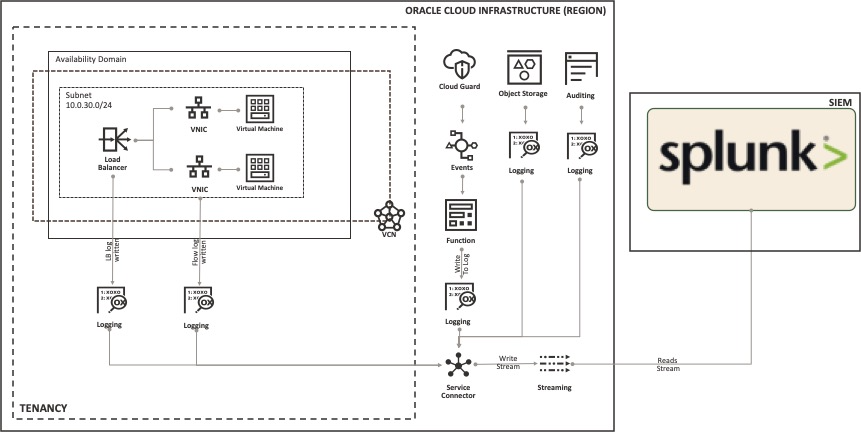
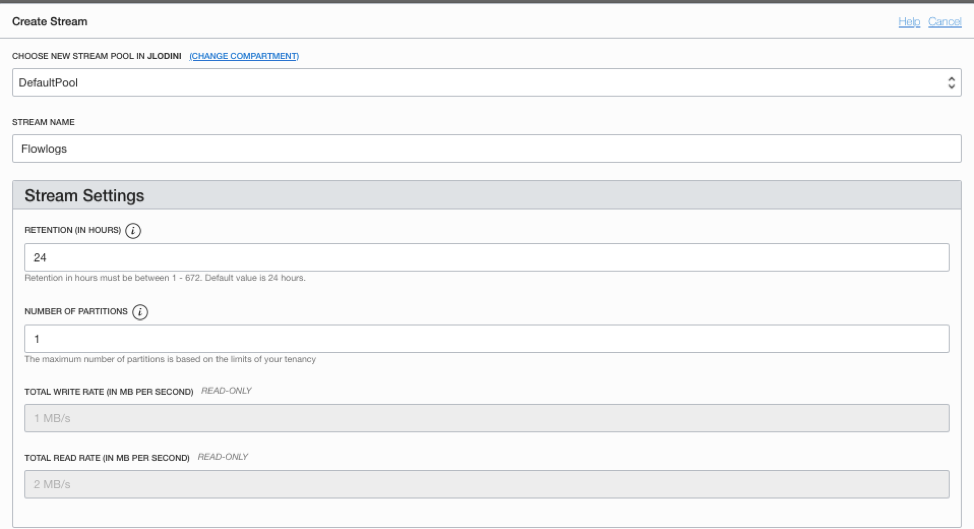
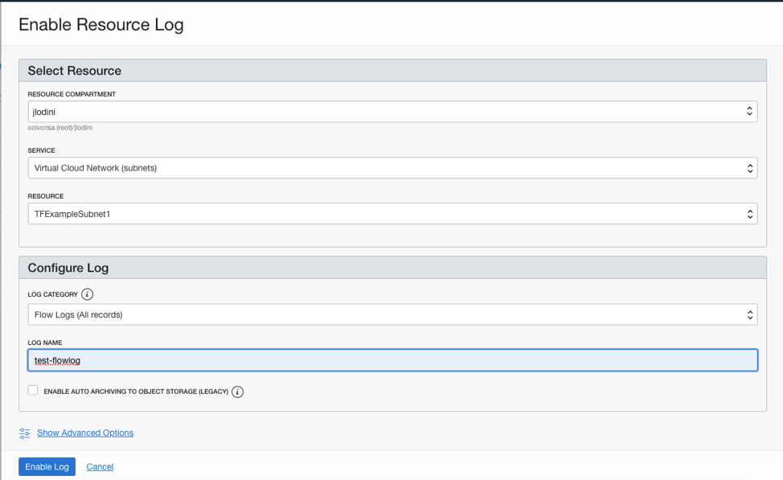
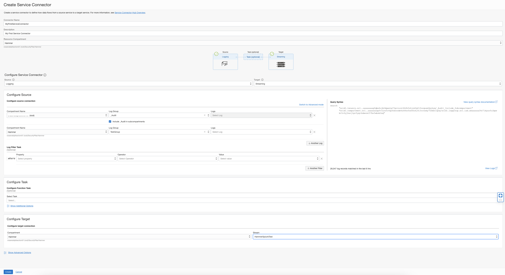
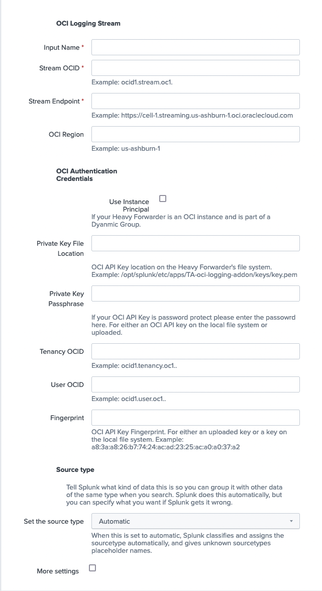

# oci-arch-logging-splunk

## Table of Contents
1. [Overview](#arch)
1. [OCI Configuration](#oci-config)
1. [Splunk Plugin Installation and Setup](#splunk-install)
1. [Prerequisites for OCI Splunk Logging Pluggin 2.2.0 and up](#prereqs)
1. [Troubleshooting](#troubleshooting)
1. [Additional Resources](#resources)
1. [Release Notes](./README/release-notes.md)
## <a name="arch"></a>Overview 

A security information and event management (SIEM) system is a critical operations tool to manage the security of your cloud resources. Oracle Cloud Infrastructure includes native threat detection, prevention, and response capabilities, which you can leverage to implement an efficient SIEM system using Splunk.

Splunk Enterprise administrators can use the Logging and Streaming services with the Logging Addon for Splunk, to stream logs from resources in the cloud to an existing or new Splunk environment. Administrators can also integrate with other Splunk plugins and data sources, such as threat intelligence feeds, to augment the generation of alerts based on log data.



## <a name="oci-config"></a>OCI Configuration 
### Step 1: Create a Stream


Refer the screenshot and the points listed below to to create a stream for log data to be written to for Splunk to collect from.

1. Open the navigation menu. Under **Analytics**, click **Streaming**.
1. Click **Create Stream**.
1. Next, select *Stream Pool* or create a new one.
1. Fill in the Stream Name field with a friendly name for your stream such as *SIEMLogStream*
1. Provide a Retention time to meet your needs.
1. Provide a Number of Partitions, Total Write Rate, and Total Read Rate based on the amount of data you need to process.

### Step 2 (Optional): Enable a Service ex. VCN Flow Log

In this step, You will create a log group and configure an example log using Virtual Cloud Network (VCN) Flow Logs.


Refer the screenshot and the points listed below to complete Step 1.

1. Open the navigation menu on Oracle Cloud Infrastructure (OCI) console. Under Solutions and Platform, go to Logging, and click on Log Groups.
1. Click Create Log Group
    1. Choose the Compartment where you want to create log group
    1. Choose a Name and Description that can properly identify your log group
1. Click **Create**
1. Next click **Logs**. The Logs page is displayed.
1. Click **Enable Service Log**. The Enable Resource Log panel is displayed.
1. Under *Select Resource*, under **Resource Compartment**, choose a compartment you have permission to work in.
1. Select a service from the Service. For example: Virtual Cloud Network (subnet)
1. Select a resource:
    1. Under *Resource*, select a subnet.
1. Configure the log:
    1. In Log Category select a log category to specify the type of log to create. For this example, you will select Flow Logs (All records)
1. In **Log Name**, type a name for the log. For this example, name it as test-flowlog.
1. Click **Enable Log**.


### Step 3: Create a Service Connector in OCI Logging

Refer the screenshot and the points listed below to complete Step 3 to create a Service Connector in OCI Logging.


1. Open the navigation menu. Under Logging, click **Service Connectors**.
1. Choose the Compartment where you want to create the service connector.
1. Click **Create Connector**.
1. On the Create Service Connector page, fill in the settings as noted below:
    1. **Connector Name:** User-friendly name for the new service connector.
    1. **Description:** Optional identifier.
    1. **Resource Compartment:** The compartment where you want to store the new service connector.
1. Configure Service Connector:
    1. Select Source: Logging
    1. Select Target: Streaming
1. Under configure source connection(_Audit Logs):
    1. Compartment: Select the *(root)* compartment
    1. Log Group: Select *_Audit*
        1. Check: **Include _Audit in subcompartments** to collect all compartment logs 
1. Under configure source connection(Service Log):
    1. Click **++Another Log**
    1. Compartment: Select the compartment that contains your log group.
    1. Log Group: Select the log group created in step 1.
        1. Leave Blank to collect all Logs in the Log Group
        1. Logs: Select the log created in step 1 to collect the single service log.
1. Under configure target connection:
    1. **Compartment**: Select the compartment that contains your stream.
    1. **Stream**: Select the stream created in step 2.

1. If you do not have an inclusive IAM policy, you will see the following message:
    1. *Create default policy allowing this service connector to write to Streaming in compartment*
    1. To resolve this, click the Create button to the right, and it will automatically create a policy for you.

1. To finish the creation click the **Create** button on the left.

### Step 4: Access control

The logging addon for Splunk supports access both by instance principals and using API signing keys. Oracle recommends using an instance principal, to avoid storing long-lived tokens. If you're not using an instance principal, use an API signing key.
Depending on the access method that you choose, define a least-privilege policy as shown in the following examples:

- If you choose the instance-principal access method:
    1. Create a Dynamic Group with with the Splunk Instance: https://docs.oracle.com/en-us/iaas/Content/Identity/Tasks/managingdynamicgroups.htm
    1. Create an OCI IAM policy like the below
        Allow dynamic-group <Splunk_Dynamic_Group> to use stream-pull in compartment <compartment_of_stream>
- If you choose the API signing key method:
    1. Create a OCI User: https://docs.oracle.com/en-us/iaas/Content/Identity/Tasks/managingusers.htm
    1. Create an OCI Group and add the above user to the group: https://docs.oracle.com/en-us/iaas/Content/Identity/Tasks/managinggroups.htm
    1. Create an API Key: https://docs.oracle.com/en-us/iaas/Content/API/Concepts/apisigningkey.htm
        1. If via CLI, add the API Public Key to user: https://docs.oracle.com/en-us/iaas/Content/Identity/Tasks/managingcredentials.htm
    1. Create an OCI IAM policy like the below:

        `Allow group <Splunk_User_Group> to use stream-pull in compartment <compartment_of_stream>`

## <a name="splunk-install"></a>OCI Configuration Splunk Plugin Installation and Setup
### Step 1: Download the Plugin

Download plugin: https://splunkbase.splunk.com/app/5222

### Step 2: Install the Plugin on the Splunk Heavy Forwarder (v8 or greater)

Directions: https://docs.splunk.com/Documentation/AddOns/released/Overview/Singleserverinstall

1. Click Install app from file.
1. Locate the downloaded file and click Upload.
1. If Splunk Enterprise prompts you to restart, do so.
1. Verify that the add-on appears in the list of apps and add-ons. You can also find it on the server at $SPLUNK_HOME/etc/apps/<Name_of_add-on>.

### Step 3: Setup the Plugin on the Heavy Forwarder

1. On the Splunk console, navigate to **Settings** then **Data Inputs**
1. Click on **OCI Logging**
1. Click **New** *Refer the screenshot and the points listed below to complete Step 3*



4. Configure the stream specific information from the information under OCI Configuration or https://docs.oracle.com/en/solutions/logs-stream-splunk/index.html:
    - OCI Logging Stream
        - Input Name - Unique name for the input
        - Stream OCID - OCID of the Stream ex. ocid1.stream.oc1.i.......
        - Stream Endpoint - Endpoint of the Stream ex. https://cell-1.streaming.<regin>.oci.oraclecloud.com
        - OCI Region - OCI region the stream is in ex. us-ashburn-1 (https://docs.oracle.com/en-us/iaas/Content/General/Concepts/regions.htm)
    - OCI Authentication Credentials
        - If you chose Use Instance Principal in OCI Configuration → Step 4: Access Control
            Select Use Instance Principal.  This means the heavy forwarder must be running in OCI.
            - Then  skip to **More settings**
        -  Copy the OCI API Key to the Heavy Forwarder's local file system (Console Generated and CLI RSA API Key)
            1. Copy the OCI API Private Key to the Splunk Heavy Forwader ex. /opt/splunk/etc/apps/oci-logging-addon-v2/key/key.pem
            1. **Private Key File Location** - The fully qualified file name of the API Key on the Splunk - Heavy Forwarder ex. /opt/splunk/etc/apps/oci-logging-addon-v2/key/key.pem
            1. **Private Key Passphrase** - Password for the private key if required.
            1. **Tenancy OCID** - Unique Identifier of the tenancy ex. ocid1.tenancy.oc1.....
            1. **User OCID** - Unique Identifier of the OCI IAM Local user associated with API key ex. ocid1.user.oc1...
            1. **Fingerprint** - Fingerprint of the OCI IAM API Key ex. aa:aa:aa:aa:aa:ae:aa:aa:aa:aa:aa:aa:ac:aa:aa:aa
            1. Select **More settings**
 
                    
    - More Setting 
        -   **Private Key via UI Upload** - **Depreciated** for backwards compatibility only
            - Documentation on how to create an RSA OCI API Key is [here](https://docs.oracle.com/en-us/iaas/Content/API/Concepts/apisigningkey.htm#two)
                1. **Private Key** - Upload the RSA OCI API Key file. 
                1. **Private Key File Location** - leave blank
                1. **Private Key Passphrase** - Password for the private key if required.
                1. **Tenancy OCID** - Unique Identifier of the tenancy ex. ocid1.tenancy.oc1.....
                1. **User OCID** - Unique Identifier of the OCI IAM Local user associated with API key ex. ocid1.user.oc1...
                1. **Fingerprint** - Fingerprint of the OCI IAM API Key ex. aa:aa:aa:aa:aa:ae:aa:aa:aa:aa:aa:aa:ac:aa:aa:aa
        - **Worker Processes** - number of partitions in the OCI Stream created in OCI Configuration → Step 2: Create
        - **Message Limit** - number of messages limit default is 10000
        - **Retry Interval** - number of seconds to sleep after getting a backoff request - default is 90 seconds
        - **HTTPS Proxy** - Proxy server information ex. *http://myproxy:port*
        - **Index** - Index for use with the OCI (Oracle Cloud Infrastructure) App for Splunk: https://splunkbase.splunk.com/app/5289/ 
5. Click **Next**


## <a name="preqs"></a>Prerequisites for OCI Splunk Logging Pluggin 2.2.0 and up
### **Supported Systems**: Linux
### **Splunk Version**: 8 or above
### **Deployment Models**: ###
- Customer owned Splunk Heavy Forwarder running on-premises forwarding to
    - Splunk on-premises (requires VPN or FastConnect)
    - Splunk Cloud
- Customer owned Splunk Heavy Forwarder running on an OCI Compute Instance(Instance Principal authentications) forwarding to:
    - Splunk on-premises (requires VPN or FastConnect)
    - Splunk Cloud

## <a name="troubleshooting"></a>Troubleshooting
- When trying to install the plugin get following: **"Error connecting to /services/apps/local: The read operation timed out"** 
    - Please follow the instructions here [https://community.splunk.com/t5/All-Apps-and-Add-ons/install-add-on-Error-connecting-to-services-apps-local-The-read/m-p/490613](https://community.splunk.com/t5/All-Apps-and-Add-ons/install-add-on-Error-connecting-to-services-apps-local-The-read/m-p/490613)
        ```
        and increase the following timeout in the web.conf
        [settings]
        splunkdConnectionTimeout = 600 
        ```
- OCI API Key Issues:
    - 8.0.x must use a OCI API Key stored on the Heavy Forwarder's Local File System 
    - 8.2.2 and up must use a OCI API Key stored on the Heavy Forwarder's Local File System 
    - If there is an issue with the OCI API key uploaded via the Web UI, have them validate that its a valid RSA key
        - Instructions for creating the key are located here - [https://docs.oracle.com/en-us/iaas/Content/API/Concepts/apisigningkey.htm](https://docs.oracle.com/en-us/iaas/Content/API/Concepts/apisigningkey.htm)
        - If there is a valid API Key getting `Splitted: 1` in your Splunk logs
            - CLRF - windows line feed – plugin can’t parse
- Ensure you have the current version of the OCI Splunk Logging plugin. The current version is available [here](https://splunkbase.splunk.com/app/5222)
- Check your Splunk python3 version `$SPLUNK_HOME/bin/python3 --version` is python 3.7.11 or below
-  'Search and Reporting" and search for the following `index=_internal error oci`
    - Authentication Error will appear here
    - Ignore UI related issues
- Enable Debug Logging: 
    - Edit `$SPLUNK_HOME/etc/apps/TA-oci-logging-addon/bin//bin/oci_logging.py`
    - Change: `logger.basicConfig(level=logger.ERROR, format='%(asctime)s %(levelname)s %(message)s',` 
    - To: `logger.basicConfig(level=logger.DEBUG, format='%(asctime)s %(levelname)s %(message)s',`
    - Go to the Heavy Forwarder:
    - Data Inputs → OCI Logging ▪ Disable and Enable the input
    - Log file location - `$SPLUNK_HOME/var/log/splunk/oci_logging.log`

## <a name="resources"></a>Addtional Resources
- Visualization App for OCI (Oracle Cloud Infrastructure) App for Splunk: [https://splunkbase.splunk.com/app/5289/](https://splunkbase.splunk.com/app/5289/)
